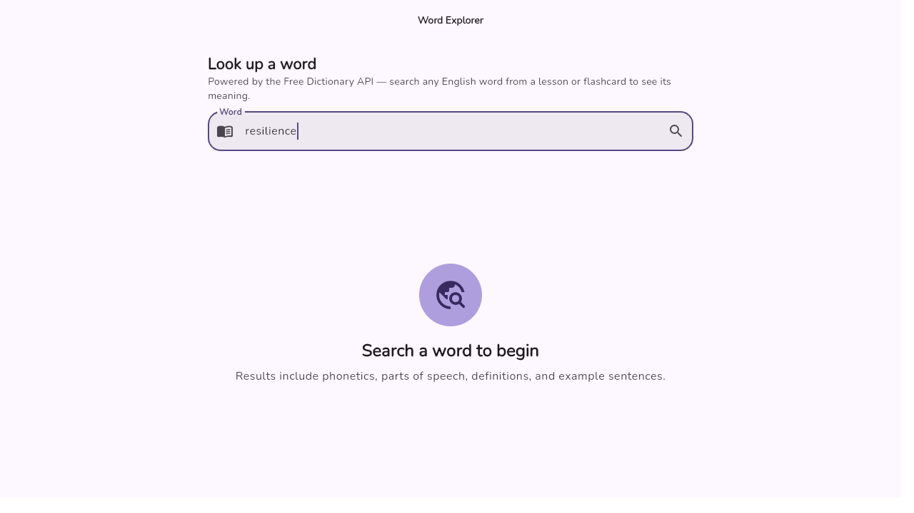
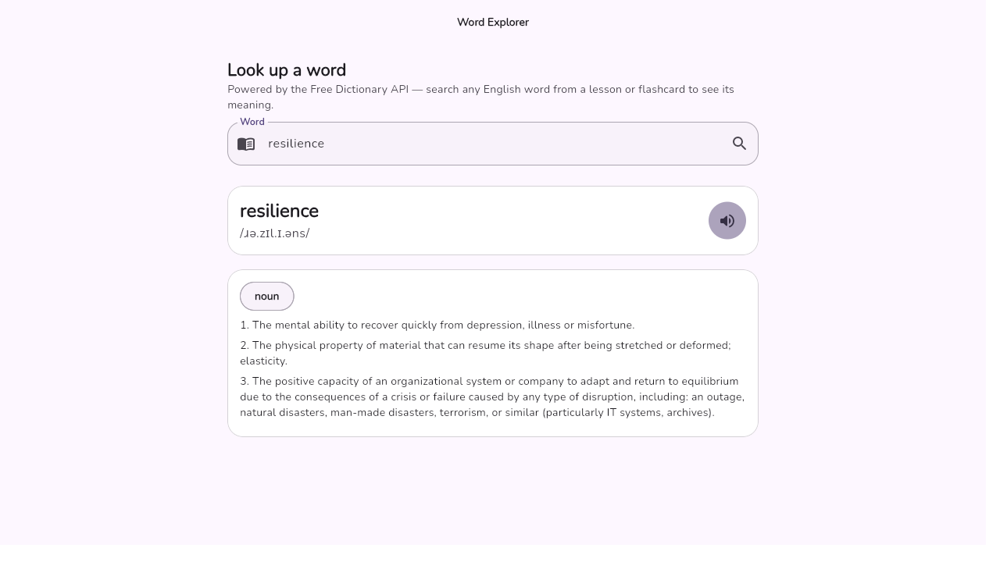
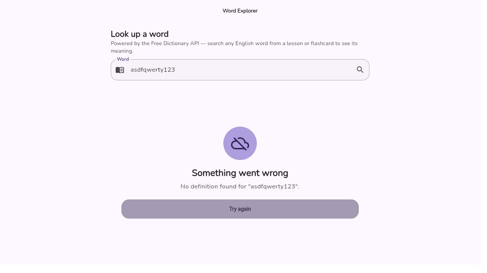

# API Integration — Word Explorer

This document describes the external API integration added to IKeriKin: the
**Word Explorer**, a vocabulary lookup tool that lets parents and children
search any English word encountered in a lesson or flashcard and see its
pronunciation, part of speech, definitions, and example sentences.

## API Used

- **Name:** [Free Dictionary API](https://dictionaryapi.dev)
- **Base endpoint:** `https://api.dictionaryapi.dev/api/v2/entries/en/{word}`
- **Method:** `GET` (public, keyless, read-only API — no `POST` endpoint is
  offered by this API, so only retrieval is implemented here; the app already
  demonstrates `POST`/write operations elsewhere via Supabase, e.g. saving
  child profiles and lesson requests)
- **Purpose in the app:** children's lessons and flashcards frequently
  introduce new English vocabulary. Word Explorer gives parents and children
  a quick, in-app way to look up any word — its phonetic spelling, parts of
  speech, numbered definitions, and usage examples — without leaving the app,
  reinforcing the app's language-learning goals.

## Architecture

The feature follows the app's existing layered structure:

| Layer | File | Responsibility |
|---|---|---|
| Domain | [lib/domain/models.dart](../lib/domain/models.dart) | Immutable `WordDefinition` / `WordMeaning` models with `fromJson` parsing |
| Data | [lib/data/repositories.dart](../lib/data/repositories.dart) | `DictionaryRepository` interface + `FreeDictionaryRepository` implementation making the HTTP GET request |
| Application | [lib/application/providers.dart](../lib/application/providers.dart) | `httpClientProvider`, `dictionaryRepositoryProvider`, and `WordLookupController` (`AsyncNotifier`) managing loading/data/error state |
| Presentation | [lib/presentation/screens/dictionary_screen.dart](../lib/presentation/screens/dictionary_screen.dart) | `WordExplorerScreen` — search field, loading indicator, results, and error UI |

## HTTP Request Implementation

`FreeDictionaryRepository.lookup()` builds the request URL, performs the GET
request with the standard `http` package, and validates the response before
parsing it as JSON:

```dart
class FreeDictionaryRepository implements DictionaryRepository {
  const FreeDictionaryRepository(this._client);
  final http.Client _client;
  static const _baseUrl = 'https://api.dictionaryapi.dev/api/v2/entries/en';

  @override
  Future<WordDefinition> lookup(String word) async {
    final trimmed = word.trim().toLowerCase();
    if (trimmed.isEmpty) {
      throw const FormatException('Enter a word to look up.');
    }
    final uri = Uri.parse('$_baseUrl/${Uri.encodeComponent(trimmed)}');
    final response = await _client.get(uri).timeout(const Duration(seconds: 10));
    if (response.statusCode == 404) {
      throw Exception('No definition found for "$trimmed".');
    }
    if (response.statusCode != 200) {
      throw Exception('Dictionary service returned status ${response.statusCode}.');
    }
    final entries = jsonDecode(response.body) as List;
    if (entries.isEmpty) {
      throw Exception('No definition found for "$trimmed".');
    }
    return WordDefinition.fromJson(Map<String, dynamic>.from(entries.first as Map));
  }
}
```

The `http.Client` is created once via `httpClientProvider` (Riverpod
`Provider`) and disposed automatically with `ref.onDispose(client.close)`.

## JSON Parsing

The response is a JSON array; the first entry is decoded into a
`WordDefinition`, which itself parses nested `meanings` into `WordMeaning`
objects (part of speech, definitions, examples):

```dart
factory WordDefinition.fromJson(Map<String, dynamic> json) => WordDefinition(
  word: json['word'] as String,
  phonetic: (json['phonetic'] as String?) ?? '',
  audioUrl: /* first non-empty phonetics[].audio, if any */,
  meanings: (json['meanings'] as List)
      .map((m) => WordMeaning.fromJson(Map<String, dynamic>.from(m as Map)))
      .toList(),
);
```

## Displaying Data in the UI

`WordExplorerScreen` watches `wordLookupControllerProvider`
(`AsyncValue<WordDefinition?>`) and renders one of three states with
`AsyncValue.when`:

- **Empty:** an `EmptyState` prompting the user to search a word.
- **Data:** a `_WordResult` card showing the word, phonetic spelling, a
  "Listen" button (uses the existing `flutter_tts` package to pronounce the
  word), and a card per part of speech with numbered definitions and
  italicized examples.
- **Loading / Error:** handled below.

## Loading States & Error Handling

`WordLookupController.lookup()` sets `AsyncLoading()` immediately, then uses
`AsyncValue.guard` to safely run the request and capture any thrown error:

```dart
Future<void> lookup(String word) async {
  state = const AsyncLoading();
  state = await AsyncValue.guard(
    () => ref.read(dictionaryRepositoryProvider).lookup(word),
  );
}
```

- **Loading:** the screen shows a `LoadingView` ("Looking up word…") spinner.
- **Invalid word / not found:** the API returns `404`, which the repository
  turns into a friendly `Exception('No definition found for "…"')`, rendered
  by `ErrorView` with a "Try again" retry action.
- **Network / server errors:** any other non-200 status, timeout, or thrown
  exception is caught the same way and shown with its message, so the UI
  never crashes on bad input or an unreachable network.

## Screenshots

| Requirement | Screenshot |
|---|---|
| API request — typing a word before submitting |  |
| Retrieved data displayed in the app |  |
| Invalid response handled gracefully (unknown word) |  |
| Raw JSON response sample | [api-json-sample.json](screenshots/api-json-sample.json) |

The JSON sample was captured directly from the live endpoint:
`GET https://api.dictionaryapi.dev/api/v2/entries/en/resilience`.

## Features Added

- New **Word Explorer** screen (route `/dictionary`), reachable from a book
  icon in the `Learn` tab's app bar.
- Live vocabulary lookup against the Free Dictionary API with phonetics,
  parts of speech, numbered definitions, and example sentences.
- "Listen" button that speaks the searched word aloud via the app's existing
  text-to-speech engine.
- Graceful loading and error states, including a specific "no definition
  found" message for unknown words and a retry action.
