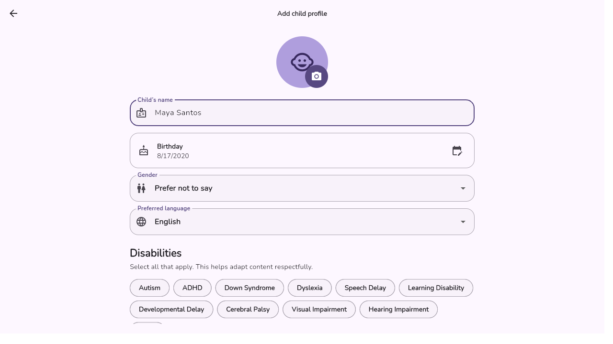
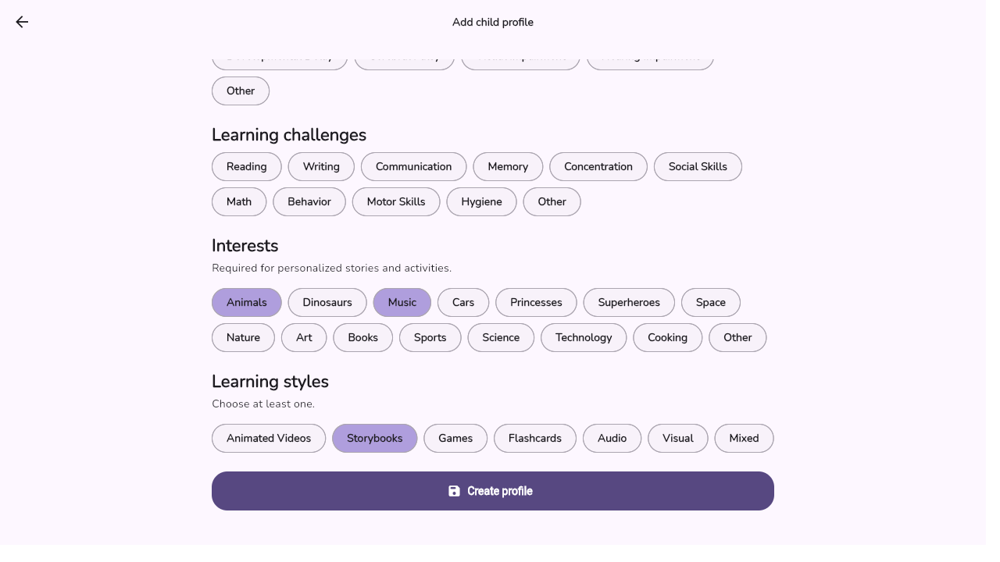
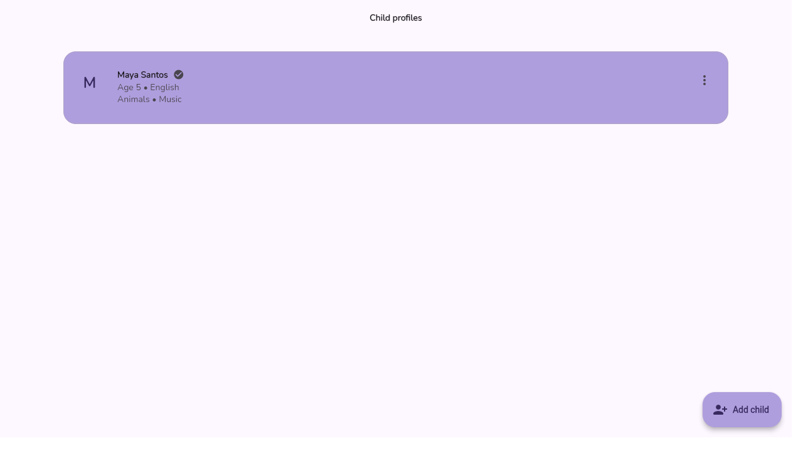
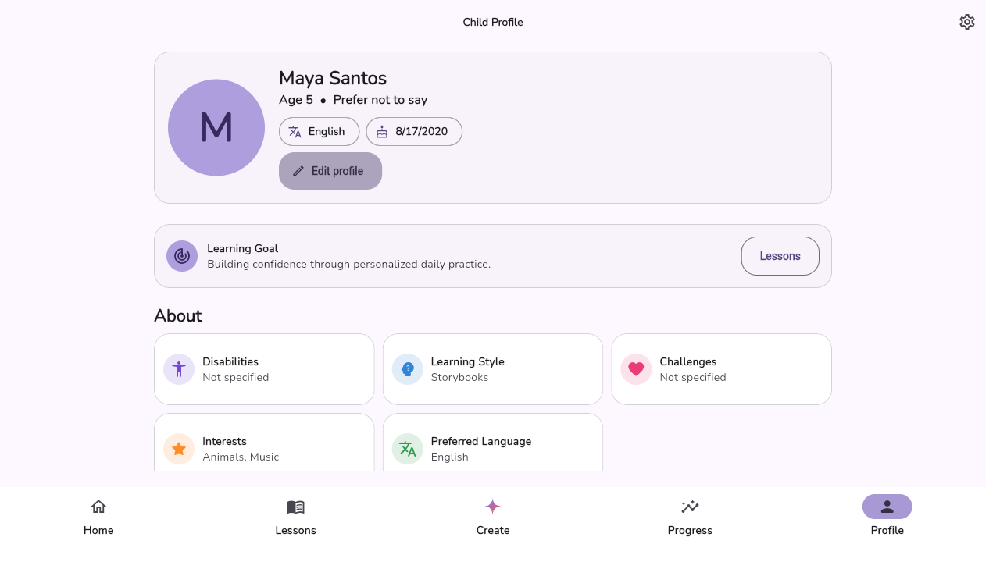
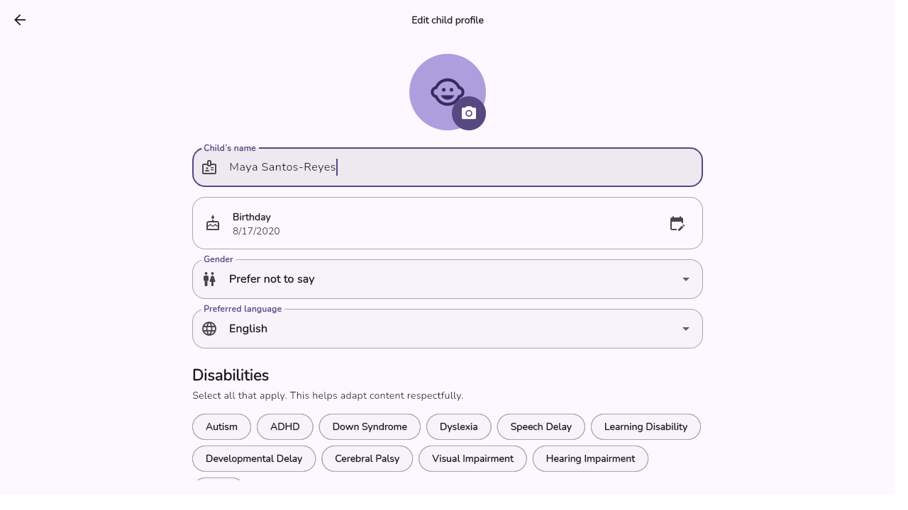
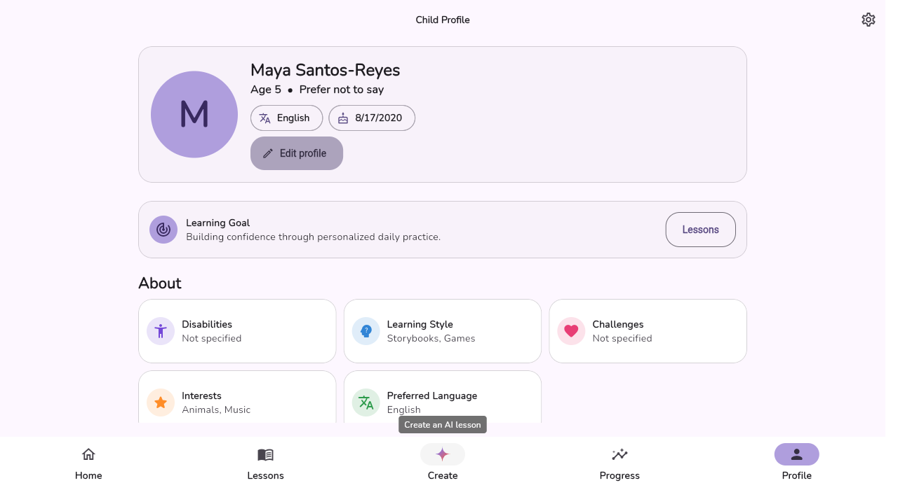
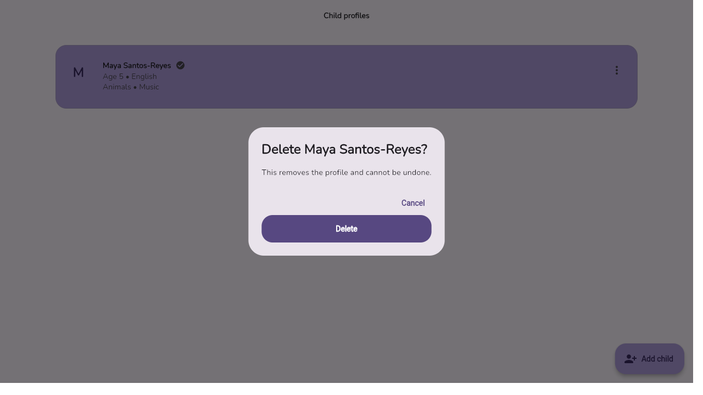
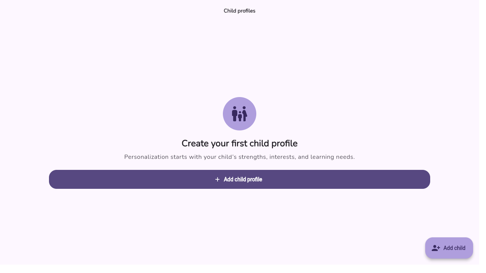

# CRUD Implementation — Child Learning Profiles

This document describes the Create, Read, Update, and Delete (CRUD) functionality
implemented for IKeriKin's core data entity: the **child learning profile**
(`ChildProfile`). Every AI-generated lesson, quiz, and progress record in the
app is personalized from this entity, making it the natural candidate for full
CRUD management.

## Entity

`ChildProfile` ([lib/domain/models.dart](../lib/domain/models.dart)) stores:

- `name`, `birthday`, `gender`, `preferredLanguage`
- `disabilities`, `challenges`, `interests`, `learningStyles` (multi-select tags)
- `photoUrl` (optional profile photo)
- `parentId`, `id`, `createdAt`

## Architecture

The feature follows the app's layered structure:

| Layer | File | Responsibility |
|---|---|---|
| Domain | [lib/domain/models.dart](../lib/domain/models.dart) | Immutable `ChildProfile` model, JSON (de)serialization, `copyWith` |
| Data | [lib/data/repositories.dart](../lib/data/repositories.dart) | `ChildRepository` interface + `SupabaseChildRepository` implementation |
| Application | [lib/application/providers.dart](../lib/application/providers.dart) | `ChildController` (Riverpod `Notifier`) coordinating save/delete; `childrenProvider` stream |
| Presentation | [lib/presentation/screens/child_screens.dart](../lib/presentation/screens/child_screens.dart) | `ChildrenScreen` (list), `ChildFormScreen` (create/edit), `ChildProfileScreen` (detail) |

## Persistent Storage

Storage is dual-mode so the app works with or without a backend configured:

- **Primary:** Supabase Postgres table `public.children`
  ([supabase/migrations/001_initial_schema.sql](../supabase/migrations/001_initial_schema.sql)),
  protected by row-level security so a parent can only read/write their own
  children (`parent_id = auth.uid()`).
- **Offline fallback / local cache:** `SharedPreferences` (`children_cache` key)
  stores the full profile list as JSON. Reads try Supabase first and fall back
  to the cache on failure; writes update Supabase (when configured) and the
  cache is refreshed on every read/stream emission, so the UI keeps working in
  "preview mode" with no server at all.

## CRUD Operations

### Create
- **UI:** `ChildFormScreen` (route `/children/new`), reached from the empty
  state, the "Add child" button, or the floating action button on
  `ChildrenScreen`.
- **Flow:** `ChildController.save()` generates a UUID (`createId()`), optionally
  uploads a photo, then calls `ChildRepository.save()`, which inserts/upserts
  the row in Supabase or appends to the local cache.

### Read
- **UI:** `ChildrenScreen` (list of all profiles) and `ChildProfileScreen`
  (full detail view: age, gender, language, disabilities, challenges,
  interests, learning style, progress summary).
- **Flow:** `childrenProvider` is a `StreamProvider.family` backed by
  `ChildRepository.watchChildren()`, which emits the cached list immediately
  and live Supabase realtime updates afterward.

### Update
- **UI:** "Edit profile" button on `ChildProfileScreen`, or the "Edit" menu
  item on `ChildrenScreen`, both opening `ChildFormScreen` pre-filled with the
  existing profile (route `/children/:id/edit`).
- **Flow:** The same `ChildController.save()` method is used for create and
  update — passing the existing `id` performs an upsert instead of an insert,
  keeping the code path identical and reducing duplication.

### Delete
- **UI:** "Delete" menu item on `ChildrenScreen`, guarded by a confirmation
  `AlertDialog` ("This removes the profile and cannot be undone.").
- **Flow:** `ChildController.delete()` calls `ChildRepository.delete()`, which
  removes the Supabase row and the local cache entry, then clears the selected
  child if it was the one deleted.

## Data Validation

- **Required name:** must be at least 2 characters (`TextFormField.validator`).
- **Required selections:** at least one interest and one learning style must
  be chosen before saving, enforced in `_ChildFormScreenState._save()` with a
  user-facing snack bar message.
- **Database constraints:** Supabase enforces `name` length
  (`char_length(name) between 2 and 100`) and non-null defaults for every
  field as a second line of defense.
- **Auth boundary:** row-level security policies ensure a parent can only
  create, read, update, or delete their own children, even if a request is
  crafted manually.

## User-Friendly Interface

- Empty states with clear calls to action ("Create a child profile").
- Chip-based multi-select for disabilities, challenges, interests, and
  learning styles.
- Inline error messages via snack bars instead of blocking dialogs.
- Delete requires explicit confirmation to prevent accidental data loss.
- The form is reused for both create and edit, so the experience is
  consistent in both directions.

## Screenshots

| Operation | Screenshot |
|---|---|
| Create — filling out the new profile form |  |
| Create — required interests/learning style selected |  |
| Read — profile list after creation |  |
| Read — full profile detail view |  |
| Update — editing the existing profile |  |
| Update — saved changes reflected immediately |  |
| Delete — confirmation dialog |  |
| Delete — profile removed, empty state returns |  |

Screenshots were captured by running the app in offline preview mode
(`flutter run -d chrome`, no `--dart-define` secrets), so persistence is backed
by browser local storage in this run and by Supabase Postgres when configured.
