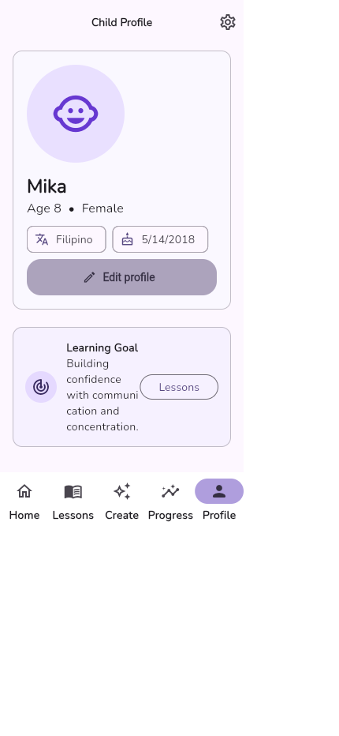
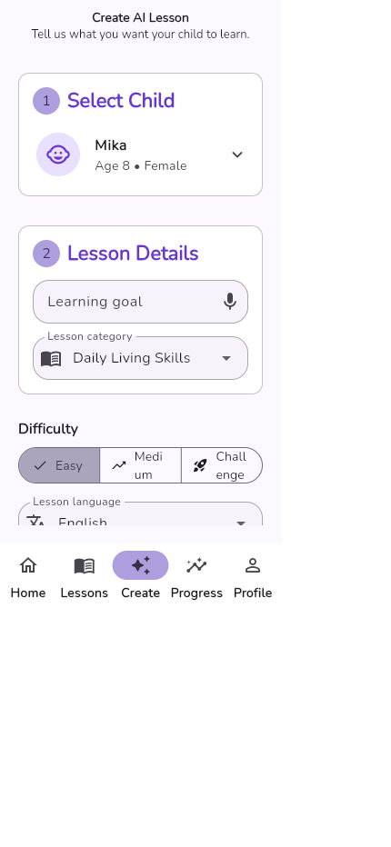
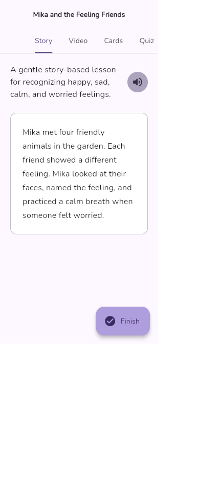
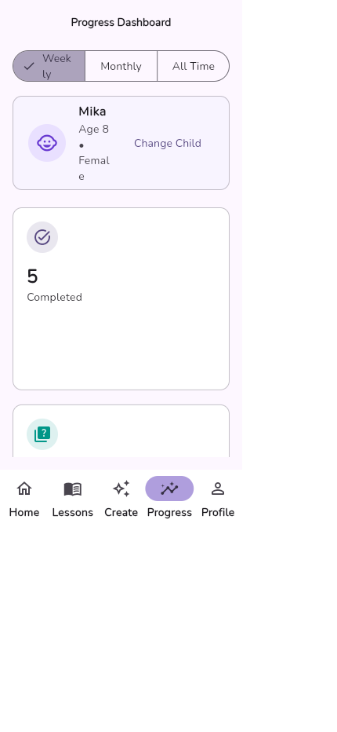

# IKeriKin Project Proposal

**Tagline:** *I Care for Your Kin*

**GitHub Repository:** [github.com/LorenzoBrentReedVarca/IKeriKin](https://github.com/LorenzoBrentReedVarca/IKeriKin)

## Project Overview

IKeriKin is an AI-powered mobile learning application for Filipino families with children who have special educational needs. Parents create child profiles containing age, disability, interests, learning preferences, challenges, and educational goals. IKeriKin uses this context to generate personalized stories, flashcards, quizzes, memory games, matching activities, daily practice, and caregiver guidance.

The application begins with English and Filipino support and is designed to expand to schools, SPED centers, educational organizations, and additional languages.

## Problem Statement

Families often spend significant time searching for learning materials that fit a child's developmental needs, interests, language, and pace. Generic resources may not be accessible or engaging. IKeriKin gives caregivers a single, accessible tool for creating appropriate activities and monitoring progress.

## Target Users

- Parents and guardians of children with special educational needs
- Children with ASD, ADHD, dyslexia, Down syndrome, speech delay, developmental delay, and learning disabilities
- Future users: schools, SPED centers, and educational organizations

## Objectives

- Improve access to personalized learning materials.
- Reduce caregiver preparation time through responsible AI assistance.
- Encourage regular practice with goals, XP, coins, streaks, and badges.
- Give caregivers understandable weekly, monthly, and all-time progress views.
- Support inclusive use through large text, dyslexia-friendly typography, high contrast, reduced motion, and text-to-speech.

## Core Features

- Secure parent registration, login, password recovery, and local preview mode
- Multiple child profiles with disability, challenge, interest, and learning-style context
- AI lesson generation in English or Filipino
- Stories, flashcards, quizzes, memory games, and matching activities
- Parent tips and daily practice activities
- Daily goals, lesson completion, quiz scores, XP, coins, streaks, and badges
- Weekly, monthly, and all-time progress reporting
- Accessibility preferences and story text-to-speech
- Optional Supabase persistence and Edge Functions for AI lesson/video generation

## Technology

- Flutter and Dart for Android, iOS, web, Windows, macOS, and Linux
- Riverpod for application state
- GoRouter for declarative navigation and deep links
- SharedPreferences for offline preview persistence
- Supabase for optional authentication, database, storage, realtime updates, and Edge Functions

## Screen Flow

1. **Home:** Welcome, active learner, daily goal, continue learning, streak, XP, and rewards.
2. **Child Profile:** Photo, age, disability, interests, learning style, challenges, progress summary, and editing.
3. **AI Lesson Generator:** Child selection, goal, profile context, difficulty, language, duration, and notes.
4. **AI Lesson:** Story, text-to-speech, flashcards, quiz, memory/matching activities, parent tips, and daily practice.
5. **Progress Dashboard:** Weekly/monthly trends, all-time summary, completed lessons, XP, badges, streak, and recommended lesson.

## Expected Impact

IKeriKin aims to make inclusive learning easier to access, help caregivers participate confidently in daily education, and keep children engaged through personalized content and positive reinforcement.

## Screenshots

### Home

### Child Profile

### AI Lesson Generator

### AI Lesson

### Progress Dashboard

## Current Status

- Revised project proposal completed
- Flutter project and organized architecture completed
- Core UI and navigation completed
- Five required screens implemented
- Offline preview data and optional Supabase integration implemented
- Static analysis and automated tests passing
- Git repository prepared with project documentation and screenshots
